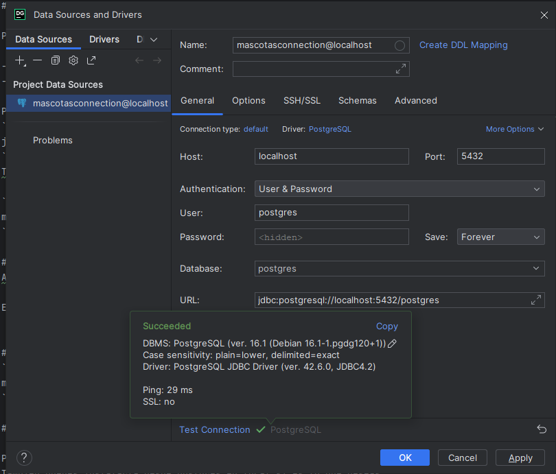

# casa-mascota-spring
Backend para el proyecto casa de la mascota realizado en Spring

## Requerimientos

Para correr este proyecto debe tener instalado:

- Java 17
- Maven 3.8.7

PD: Asegurese tener instalado Java correctamente con la version indicada, tener JAVA_HOME configurado
```
java -version
```
Tambien tener maven instalado correctamente

```
mvn -version
```

## Para compilar el proyecto
Asegurese de estar en la carpeta del pom.xml

Es decir ejecutar el proyecto desde su IDE preferido en la carpeta 'spring-todolist-backend'


### Para limpiar el proyecto e instalar dependencias con maven
```
mvn clean install
```

## Ejecución

PD: antes Instale la base de datos por primera vez o vuelva a iniciar al base de datos con docker "docker start todolistdb"
Tambien puedes instalarla desde postgres en local si es lo que deseas.
```
mvn spring-boot:run
```
Errores comunes:

Algun servicio esta corriendo en el puerto 8080, asi que mata ese servicio o usa otro puerto

## Instalación de la Base de Datos

1. Hacer correr una instancia Postgres en docker:

Este codigo nombra el contenedor: "pets", con contraseña: "pets123"

Para conectarse desde nuestro puerto: "5432" hacia el puerto "5432"(NO CAMBIAR ESTE, viene por defecto para conectarse a postgres correctamente)

Descargando como imagen postgres de la version "16"(ultima version octubre-2023)


```
docker run --name pets -e POSTGRES_PASSWORD=pets123 -p 5432:5432 -d postgres:16
```

2. Me conecto a la DB database mediante DataGrip

   Use estas credenciales, puede cambiarlas si desea
```
Host: localhost
Port: 5432
Authenticacion: User & Password
User: postgres
Password: pets123
Database: postgres
```
Se hace "Test Connection con esas credenciales y se conecta con Datagrip"


3. Ejecutan el script "init.sql" de la carpeta "database".

PD: Es importante tener las tablas, caso contrario no funcionara el proyecto correctamente

4. Para datos de prueba ejecuten "dataexample.sql" dentro de postgres

5. Verificar en la carpeta "resources" en "application.properties"
EL puerto 8080 este libre, caso contrario usar otro puerto

username, password sean los configurados anteriormente

que exista "PostgreSQLDialect" conectado para nuestra bdd postgres

Que "spring.jpa.hibernate.ddl-auto=none" este en none, 
porque en este caso tendremos la base de datos creada con las tablas ya creadas(paso 3)
```
server.port=8080

spring.datasource.url=jdbc:postgresql://localhost:5432/postgres?useSSL=false
spring.datasource.username=postgres
spring.datasource.password=pets123
spring.jpa.properties.hibernate.dialect=org.hibernate.dialect.PostgreSQLDialect
spring.jpa.show.sql=true
spring.jpa.hibernate.ddl-auto=none
```
---

Nota: Una vez hecho el paso 1, para volver a correr el contenedor de docker(que tiene la base de datos)

```
docker start pets
```
---
