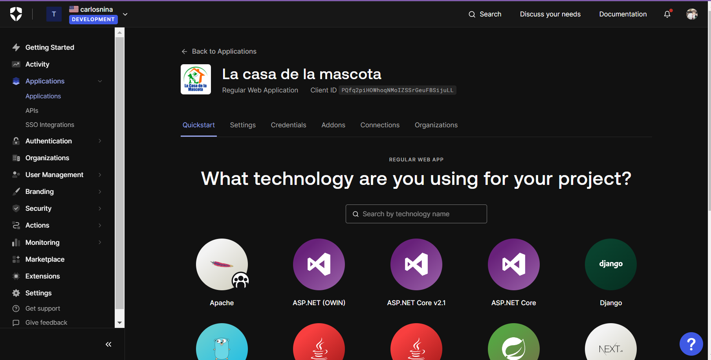
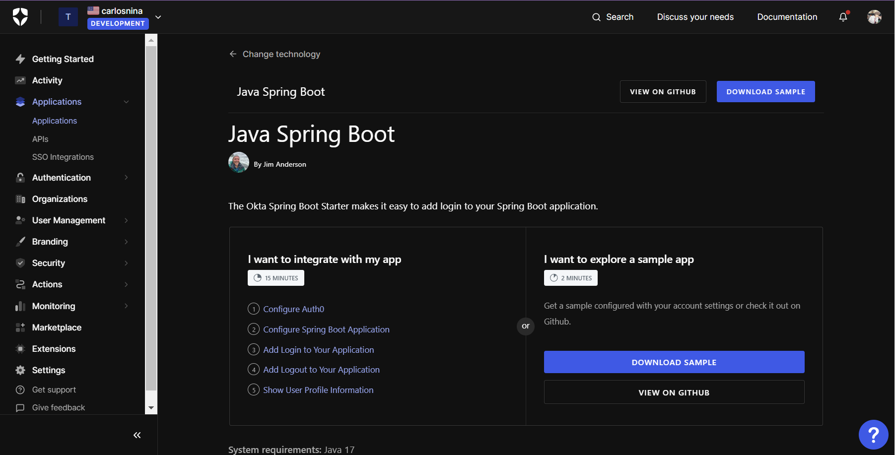

### Configuracion de OAuth0 en la aplicacion de la casa de la mascota:

Primeramente se debe crear una cuenta en Auth0, entrar a "manage"

Luego Crear una aplicacion y elegir "Regular Web Aplication"

Elegir: Spring boot 

Seguir los pasos para configurar:
PD: para la primera dependencia en 20/Nov/2023 me dio error, asi que use esta libreria de maven en su lugar:
https://mvnrepository.com/artifact/com.okta.spring/okta-spring-boot-starter/3.0.5

Se sigue los pasos importando dependencias, añadiendo SecurityConfig, 
HomeController y un template con el que primero iniciaremos para mandarnos 
a iniciar sesion en Auth0 con el login universal

Recordar en las Callbacks se configura dentro de settings en la aplicacion y debe hacerse con el puerto a trabajar en el backend spring boot JAVA

PD: para nuestro proyecto se uso application.properties a la hora de configurar el issuer, client-id y client-secret (el ejemplo es en .yml)

Ejemplo que propone en MVC con graddle:
https://github.com/auth0-samples/auth0-spring-boot-login-samples/tree/master/mvc-login

